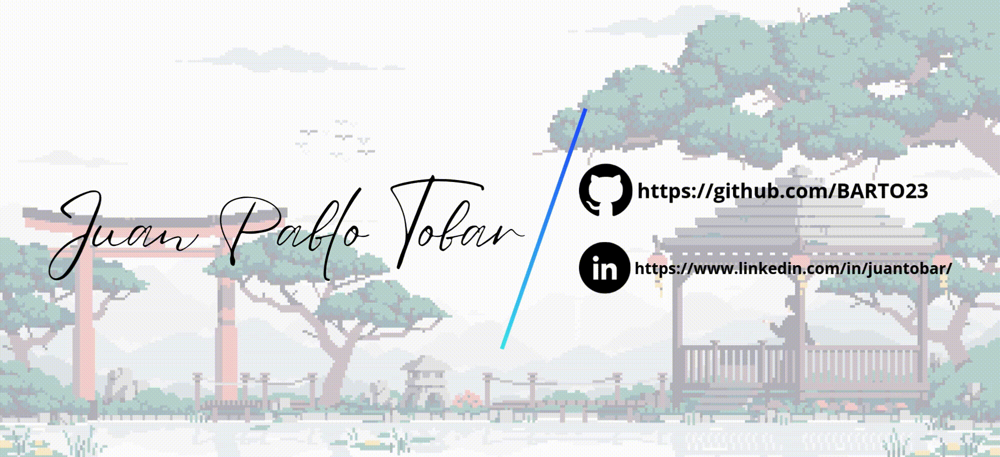

  

 

  
  

---

<h1 align="center">Hi there 👋, I'm &lt;JuanPablo /&gt;</h1>

  My name is <b>Juan Pablo Tobar Muñoz</b>. 
  I am a <b>Systems Engineer</b> focused on connecting high-performance data architectures with modern, user-friendly interfaces.
    
  I build accessible and maintainable frontend applications with <b>React & Next.js</b>, and design automated data pipelines and ETL processes using <b>Python, SQL, and Airflow</b>.
   
  My goal is simple: turn complex data into practical, user-centric solutions.

---

## 🛠️ Tech Stack

### Frontend Development

  

### Backend & Data Engineering

  

### Tools & Infrastructure

---

## 📊 GitHub Stats

  

---

## 📜 Quick Facts

  🎓 <b>Education:</b> Systems Engineering – Universidad Católica Luis Amigó 
  🌍 <b>Languages:</b> Spanish (Native) · English (B1) 
  🚀 <b>Core Focus:</b> Clean code, scalable data pipelines & responsive web design

